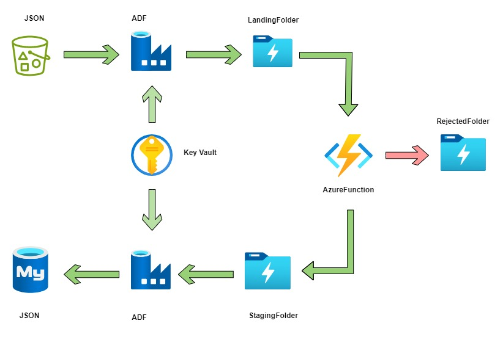

# azure-data-engineer-project-customer-food-purchases

## Beginner Data Engineering Project 
## Description

A food chain service consolidates the customer purchases data at the end of the each day, a JSON formatted file will be added into S3 bucket.  

This project gives a real-time understanding of how data is ingested into Azure SQL from S3 bucket using ADLS Gen2, ADF, Key Vault, Azure Functions, Pipelines, Storage Trigger.  

## Prereq

1. [Azure account] (https://azure.microsoft.com/) to setup azure services
2. [AWS account](https://aws.amazon.com/) to set up S3 Bucket component

By the end of the setup you should have(or know how to use)

1. `S3` Bucket
2. `AZURE SQL` Configuring a new database and accessing it.
3. `AZURE DATA FACTORY` Creating pipelines to perform actions.  
4. `AZURE DATA LAKE STORAGE GEN2` Configuring Storage account with region and redundancy
5. `AZURE FUNCTION` Creating an Azure function, using it as Storgae Trigger
6. `AZURE KEY VAULT` Configure a Key Vault with region, and access policies

## Design

## Data

Data is available at [data](customer-purchases-in-json/*.json) this folder.
This data can be generated using the [Script](generate-purchases-data/script_purchase_data.py)
Follow the steps in Py file to generate the purchases-data.

## Steps

1. Create an `S3` bucket, with proper IAM policies. Generate the AccessID and AccessKEY for the S3 Bucket to access it from a different environment, Azure for an example. 

2. Create `ADLS` storage account, KeyVault account under the Same Subscription to have an easy access among the services with easy billing. 

3. Add the AccessID and AccessKEY in Azure `Key Vault` with right access policies, choose the recommended access policy. 

4. Access `Azure Data Factory`, Create New Pipeline with Copy Data action, define the Source and Sink, with respective `Linked services` connecting to `S3` and `ADLS`. 

3. With this, We should be able to ingest the data into `ADLS`, if we run the Pipeline. 

4. Now considering all this process to be automated by itself, We need to create a `Storage Trigger`. 

5. Storage Trigger - Upon data arrival into ADLS, the pipeline should get triggered that ingests the right formatted data only into `Azure SQL`. 

